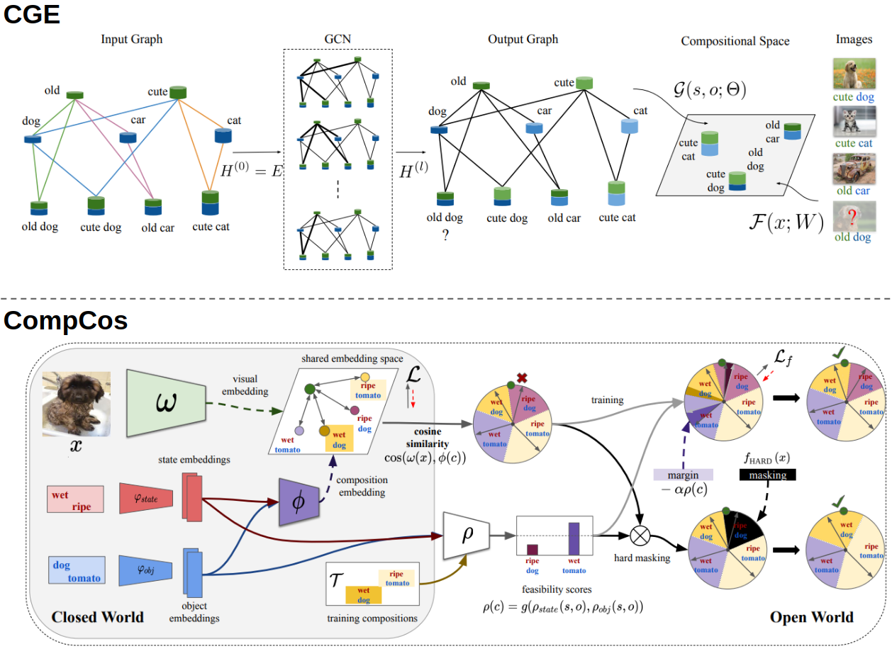

# Compositional Zero-Shot Learning
This is the official PyTorch code of the CVPR 2021 works [Learning Graph Embeddings for Compositional Zero-shot Learning](https://arxiv.org/pdf/2102.01987.pdf) and [Open World Compositional Zero-Shot Learning](https://arxiv.org/pdf/2101.12609.pdf).  The code provides the implementation of the methods CGE, CompCos together with other baselines (e.g. SymNet, AoP, TMN, LabelEmbed+,RedWine). It also provides train and test for the Open World CZSL setting and the new C-GQA benchmark.  

**Important note:** the C-GQA dataset has been updated (see [this issue](https://github.com/ExplainableML/czsl/issues/3)) and the code will automatically download the new version. The results of all models for the updated benchmark can be found in the [Co-CGE](https://arxiv.org/abs/2105.01017) and [KG-SP](https://openaccess.thecvf.com/content/CVPR2022/html/Karthik_KG-SP_Knowledge_Guided_Simple_Primitives_for_Open_World_Compositional_Zero-Shot_CVPR_2022_paper.html) papers.

<p align="center">
  
</p>

## Check also:
- [Co-CGE](https://ieeexplore.ieee.org/document/9745371/) and its [repo](https://github.com/ExplainableML/co-cge) if you are interested in a stronger OW-CZSL model and a faster OW evaluation code.
- [KG-SP](https://openaccess.thecvf.com/content/CVPR2022/html/Karthik_KG-SP_Knowledge_Guided_Simple_Primitives_for_Open_World_Compositional_Zero-Shot_CVPR_2022_paper.html) and its [repo](https://github.com/ExplainableML/KG-SP) if you are interested in the partial CZSL setting and a simple but effective OW model.

  
## Setup 

1. Clone the repo 

2. We recommend using Anaconda for environment setup. To create the environment and activate it, please run:
```
    conda env create --file environment.yml
    conda activate czsl
```

4. Go to the cloned repo and open a terminal. Download the datasets and embeddings, specifying the desired path (e.g. `DATA_ROOT` in the example):
```
    bash ./utils/download_data.sh DATA_ROOT
    mkdir logs
```


## Training
**Closed World.** To train a model, the command is simply:
```
    python train.py --config CONFIG_FILE
```
where `CONFIG_FILE` is the path to the configuration file of the model. 
The folder `configs` contains configuration files for all methods, i.e. CGE in `configs/cge`, CompCos in `configs/compcos`, and the other methods in `configs/baselines`.  

To run CGE on MitStates, the command is just:
```
    python train.py --config configs/cge/mit.yml
```
On UT-Zappos, the command is:
```
    python train.py --config configs/cge/utzappos.yml
```

**Open World.** To train CompCos (in the open world scenario) on MitStates, run:
```
    python train.py --config configs/compcos/mit/compcos.yml
```

To run experiments in the open world setting for a non-open world method, just add `--open_world` after the command. E.g. for running SymNet in the open world scenario on MitStates, the command is:
```
    python train.py --config configs/baselines/mit/symnet.yml --open_world
```
**Note:** To create a new config, all the available arguments are indicated in `flags.py`. 

## Test
 

**Closed World.** To test a model, the code is simple:
```
    python test.py --logpath LOG_DIR
```
where `LOG_DIR` is the directory containing the logs of a model.


**Open World.** To test a model in the open world setting, run:
```
    python test.py --logpath LOG_DIR --open_world
```

To test a CompCos model in the open world setting with hard masking, run:
```
    python test.py --logpath LOG_DIR_COMPCOS --open_world --hard_masking
```


## References
If you use this code, please cite
```
@inproceedings{naeem2021learning,
  title={Learning Graph Embeddings for Compositional Zero-shot Learning},
  author={Naeem, MF and Xian, Y and Tombari, F and Akata, Zeynep},
  booktitle={34th IEEE Conference on Computer Vision and Pattern Recognition},
  year={2021},
  organization={IEEE}
}
```
and
```
@inproceedings{mancini2021open,
  title={Open World Compositional Zero-Shot Learning},
  author={Mancini, M and Naeem, MF and Xian, Y and Akata, Zeynep},
  booktitle={34th IEEE Conference on Computer Vision and Pattern Recognition},
  year={2021},
  organization={IEEE}
}

```

**Note**: Some of the scripts are adapted from AttributeasOperators repository. GCN and GCNII implementations are imported from their respective repositories. If you find those parts useful, please consider citing:
```
@inproceedings{nagarajan2018attributes,
  title={Attributes as operators: factorizing unseen attribute-object compositions},
  author={Nagarajan, Tushar and Grauman, Kristen},
  booktitle={Proceedings of the European Conference on Computer Vision (ECCV)},
  pages={169--185},
  year={2018}
}
```
